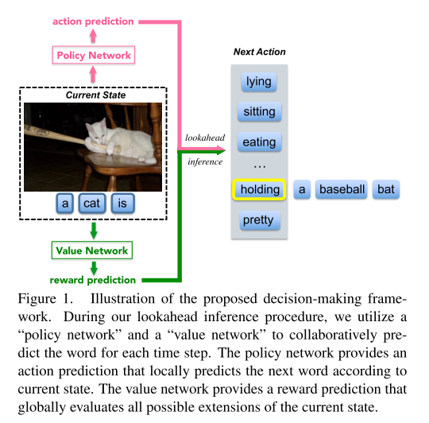

# Deep Reinforcement Learning-based Image Captioning with Embedding Reward

## Abstract
* Policy network  とvalue network の協調によるcaption生成
* Policy network はlocalな予測、value network はglobal な予測をそれぞれ担う。
* ground-truth に近しいキャプションの生成を行なう。
* model はactor-critic reinforceement learning を使用
* 異なる評価指標,MSCOCOでの実験でSOTA

## Published
2017/04

## 1 Introduction
* 通常の先行文献[3, 44, 30, 17, 7, 46,
15, 48, 43] はencoder-decoderモデル。

* policy network はlocalに、現在の状態から次のwordの予測のconfidence を与える。
* "The value network, that evaluates the reward value of all possible extensions of the current state, serves as a global and lookahead guidance."

* policy network とvalue network の両方を扱うために, embedding reward を用いた深層強化学習を利用

* 手順
  * まつ、通常のcross entropy loss でpretrainしたpolicy networkと、mean squad loss でpretrain したvalue network を用意する。
  * この2つのネットワークを　deep reinforcement learningで改善することを考える。
  * image caption において、通常の強化学習と比べて、何をappropriate  optimization goal として定義すべきなのかは、自明ではない。

  * この論文では、actor-critic モデル[21]を採用しつつ、rewardには、visual-semantic embedding[11,19,36,37] を使用。

  * MSCOCO での実験、複数の評価指標の下での実験。

## 2 Related work
### 2.1 image captioning
 * image captioning の簡単な歴史
   * bottom-up paradigm
   * encoder-decoder Model
   * spatial attention[46], semantic attention[48]
   * Dense captioning[16]
   * sequence level training[35]
### 2.2 Decision-making
[35] がenc-dec ,この論文はdescision making .

## 次に読むべき論文
[21] actor critic model
[11,19,36,37] visual semantic embedding 結局読む必要がある
[35] : 35 に勝ったと主張
