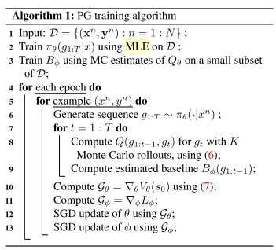

# Improved Image Captioning via Policy Gradient optimization of SPIDEr

## Abstract
* log likelihood ベースのキャプション生成ではなく、policy gradient ベースによるキャプションの改善を提案。

* Monte Carlo rolloutを用いたpolicy gradient methodであって、policy gradient を用いたmaximum liklihood evaluation ベースの手法ではない。

* 先行研究のMIXER approachと比較して良い結果であると報告

## 1.Introduction
* 大抵の場合は、統計学的に優位な量のtrain dataが必要であることの指摘
* trainは、データセットのlog liklihoodを高めるようにtrainが行われる。その場合、種々の異なる評価指標によって、test set もまた評価される。

* standard なキャプションデータセットとしては、COCO等。評価指標としては、　BLEU, METEOR, ROUGEなどがある。

* image caption に向けたCIDEr[20]の登場。4つまとめてBCMRとする。

* AndersonらのSPICE評価指標では、sentenceをparseし、scene graphを生成、scene graphのrepresentation を得る。一方でgenerated sentence に対しても同様の手続きを踏み、比較する。

* syntactic factorよりも、semantic similality をより反映した評価指標であると言える。

* ただ、SPICEはnon-differentiableである。

* non-differentiableな対象を、image captionの文脈で最初に最適化しようとした文献は[15]

* 本手法では、MIXERに対する改善案を提示する。本論文では、Monte Carlo rollout を、より良いvalue function の予測に用いる。これは、MLE目的関数との混合してしまう必要を避けるためでもあr兎。

* 本手法では、より早い収束を示したことを述べる。また、learning rate やhyper parameter に対してrobustであることも述べる。

* 提案するpolicy gradient ベースの手法が、他のBCMRmetricsの最適化に使用できることについて述べる。

* まとめると、主張は以下の4つである。
  * 新しい評価指標であるSPIDErの提案
  * 新しい、policy gradient ベースの手法の提案
  * 新手法がBCMRmetricsも最適化出来ることを示す
  * 他の評価手法を用いるよりも、SPIDErを最適化した方が、human evaluation score が上昇することを示す。

##2. Related works
### 2.1 models
 * 大抵の手法はCNN-RNNをencoder-decoderとして使用しており、今回の手法でもencoder-decoder はShow and Tell モデルを使用する。

 * Show and Tell モデルの拡張が複数存在するが、これらの先行研究と本研究は異なるものであることを強調している。

###2.2 metrics and object functions
 * MLEベースの問題点として、train時に、毎回ground truthにて観測された、一つ前のwordに現在の状態が条件付けされる点が挙げられる。

 * この状態では、test時にexposure biasが発生する。
 * [15]と本論文の手法が似ている。これについて2.3にて詳しく述べる。

###2.3 MIXER
* [15] においては、各sequenceの中間報酬(intermediate reward)であるwordについて、どのwordも、sequence-levelの報酬としては同じ価値を持つと暗に仮定している。
* また、MIXERはハイパーパラメータに対して極めて敏感である。
* 本手法では、Monte calro rolloutsに基づいて、future reward を予測する手法が、上記の二点を改善することを示す。

## 3.methods
### 3.1 Trainingh using policy Gradient
* 各sequence step $t$ において、discrete action を取る。このactionとはすなわち、vocabularyの集合 $\mathcal{V}$ の中からword $g_t \in \mathcal{V}$ を逐次選択することに対応する。
* この時使用するstochastic policy あるいはgenerator は $\pi_{\theta}(g_t|s_t,\boldsymbol{x})$ であり、 $s_t$ は予測するまでに生成された系列、$\boldsymbol{x}$ はencodeされたimage、$\theta$ はモデルのパラメータである。

* 生成されたトークンがEOSであった場合、ある $n$ 番目の画像 $\boldsymbol{x}^n$ と ground truth $\boldsymbol{y}^{n}$ に対して、全系列のreward $R(g_{1:T}|\boldsymbol{x}^n,\boldsymbol{y}^n)$ を得る。

* 本手法では、中間intermediate reward をモデルが得ることは無く、系列全体の予測終了時にrewardを見る.

* 中間状態の報酬の予測は、monte-carlo rolloutsを用いて行われる。

* まず、value function を以下のように定義する。
$$V_\theta (g_{1:t}|\boldsymbol{x}^n,\boldsymbol{y}^n)= E_{g_{t+1 : T}}[R(g_{1:t};g_{t+1:T}| \boldsymbol{x}^n, \boldsymbol{y}^n)]\tag{1}$$
 ただし、expectation は $g_{t+1:T} \sim \pi_\theta(\cdot|g_{1:t}, \boldsymbol{x}^n)$ .

 * 目標は、全サンプルに対する平均のreward をmaximizeすることである。　initial state は全サンプルで共通の$s_0$ であるとして

 * まず、value function
 $$J(\theta) = \frac{1}{N}\sum_{n=1}^N V_{\theta}(s_0|\boldsymbol{x}^n, \boldsymbol{y}^n)\tag{2}$$

 を最大化することが目標である。

 * あるサンプル $n$に限定して考える。[17]の理論によれば、また、証明は[2]に譲るが、$J$ のgradientは
 $$\nabla_\theta V_\theta(s_0) = E_{g_{1:T}}[\sum_{t=1}^T \sum_{g_t \in \mathcal{V}} \nabla_\theta\pi_\theta(g_t|g_{1:t-1})Q_\theta(g_{1:t-1},g_t)]\tag{3}$$

 である。
 state-aciton pair としてのQ関数は以下のように定義される。
 $$Q_\theta(g_{1:t-1},g_t) = E_{g_{t+1:T}}[R(g_{1:t-1};g_t;g_{t+1:T})]\tag{4}$$

  $M$ sample path から、value function のgradient を近似することが可能になり、

　

* Q関数の予測については、[30]に従う。結果として、6式を得る。

* Vのgradient消失問題については、[31],[23]を参考にしたと著者らは記している。7式の導出にも[31].[23]を使用している。

まとめると、アルゴリズムは以下のようになる。

##その他
以下はEncoder-Decoderの説明、実験設定についてでありい、ここでは省略する。
この論文で理解できていない部分は非常に多い。　

###　わからない点,ポイントは
 * $\pi$ とは
 * $Q$ とは
 * MCestimate とMLEとの違いは?
 * gradient の導出
 * 参照文献を読まないことには、どうしようもない。
 * policy gradient theorem については[17]
 * special case of deterministic transition function　での、$V$のgradientの導出について[2]
 * [30] Monte Carlo method を用いたGAN trainning について
 * [31,23] 勾配消失問題に対応した場合の、 $V$のgradient の近似について。

## 次に読むべき論文
[1] AndersonらのSPICE評価指標
[15] non-differentiableな対象を、image captionの文脈で最初に最適化しようとした文献は[15]
[4] exposure bias の発生について
[30] monte carlo methodを用いた　GAN trainingの発想が極めて本手法に似ている。必ず読む必要がある。
[2] actor critic algorithm の証明、必ず読む必要あり
[31][23]　勾配消失問題についての対策式をこの2文献で導出してある。

アルゴリズムは以下のとおりである。
