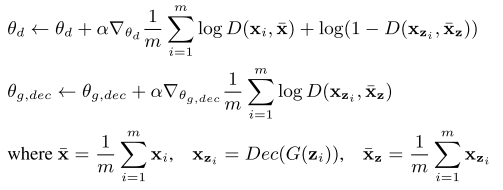

# Generating Multi-label Discrete Patient REcords using Generative Adversarial Networks

## Abstract
 * privacy concern を克服するEHRの生成
 * input: real patient records, output:high-dimentional discrete variables

## 1 Introduction
 * 本論文では、event sequence の生成ではなく、high dimensional discrete variables の生成を行なう。この問題そのものがchallenging な課題である。

## 2 Related works
### Syhthetic Data generation for health Data:
high dimentional multi-label discrete variables って結局、何なのか不明。それを生成したいということは分かる。

## 3 Method
### 3.1 EHR Data and notation
* $\mathcal{C}$ 次元のdiscrete variable(binary?) を考える。
* $\boldsymbol{x} \in \{0,1\}^{\mathcal{C}}$, $i$ th dim が表すのは、patient record の中に、$i$ 番目の変数が発生したかどうかを表す。
*
* count variables の分布を学習することは、一般に容易ではない。単純な共起を学習する以上のことをしなくてはならないので。

* かつ、train data 内のdata imbalance にも対処する必要がある。

### 3.2 Preliminary : GAN
GANの復習

$\mathcal{\boldsymbol{z}}$ はrandom prior であって、Discriminator は　Generatorが生成したものをfake かreal か見分ける。D,G は以下のようなmini-max game を行なう。

$$\min_{G}\max_{D}V(G,D) = \mathbb{E}_{\boldsymbol{x} \sim p_{data}} [\log {D(\boldsymbol{x})}] + \mathbb{E}_{\boldsymbol{z} \sim p_{\boldsymbol{z}}} [\log {(1 -D(G(\boldsymbol{z}))})]$$

この間、 $D,G$ のパラメータ　$\theta_d,\theta_g$ を更新する。

### 3.3 medGAN
 * autoencoder の説明がここで出てくる。通常のGANでは固定長次元のベクトルしか用いることが出来ないので、これを可変長にしたいがためにautoencoderを用いる。
 * "Autoencoders are trained to project given samples to a lower dimensional space, then project them back to the original space"

 * Autoencoder-GAN をつなげることでend-to-endのfine-tuning が可能に

 * autoencoder の目的（関数）は、自身の再構成を行った時に、その誤差が小さくなるようなパラメータを学習することである。

 * GANに関係なく、上記のautoencoderは、患者のrecordのみによって学習され、pretrain autoencoder が完成する。このautoencoderを用いて、種々の次元長のpatient record　を固定長に変換し、GANに学習させる。

 * 実際にtrain する場合、生成され、Decoder によって通常（患者記録）次元へと戻された $\boldsymbol{x_{\boldsymbol{z}_i}} = \mathcal{Dec}(G(\boldsymbol{z}_i))$ は、countの分布という元の患者履歴の定義により、整数でなくてはならず、ここでrounding をすべきかどうかという問が発生する。著者らによれば、rounding を行わないほうが、より良いpredictive perdformance を発揮する。

### 3.4 minibatch Averaging
 * mode collapse 問題への対処としてminibatch averaging を取り上げる。バッチ内で平均化したサンプルをGANに食わせる。

 

### その他
metricsがよくわからない。
