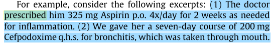
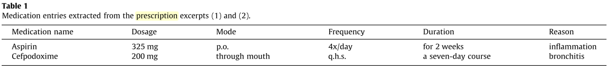

# Prescription extraction using CRFs and word embeddings
## Abstract
* Hand writtern based なdischarge summaryから、如何にprescriptionの概念に関わるものを抽出するか

## 1.Introduction
* そもそも、手書きのdischarge summary はコンピュータが読めるように書かれたものではない。a

  
  * discharge summary からのmedication   entity 抽出で、例えば

  である場合のmedication extractionは

  

   となる。

* 上の表を得た後、relation extraction を通して medication ent**r**yを作成する。この**entry**は署名情報(?:signature information)と直結し、最終的なoutput となる。

* 本手法ではword embedding + CRF→Relation extactionの2段階を用いたmedication information の抽出を行なう。

* phrase-level f1 で0.864

## 2 Related works
### 2.1 Medication extraction systems

* 先行研究の、SVM+CRFおよびSVM単体との比較、及び、その他特徴量やルールベース、パターンマッチのみを用いた先行研究を引き合いに、CRFの強さを説く。

### 2.2 Word embeddings in NER
* NER にword2vec, GloVeを用いることの有効性について

## 3 Data
* The third i2b2 challenge on NLP for Clinical Records

## 4 Methods

 前処理:NLTKでtokenize, 数字を一括変換など
 ナイーブベイズ、SVM,決定木、CRFでの比較、5分割cross-validation
 phase-level F1valueで比較

 googleSearchAPIによるconcept の手書きミスの修正

## 次に読むべき論文
Deepなarchitectureは用いていないので、参考程度に。
ただ、CRFのみでも狙ったconceptのextractionが抽出できることには注目したい。
　
