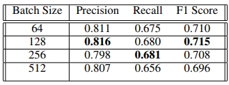

# Tagging Patient Notes With ICD-9 Codes
## Abstract
 * patient notes の最も重要なfeatureである、ICD-9 code
 * 今回は、この問題をmulti-label text classification 問題として解くことを考える。
 * deep とは言っているが結局のところLSTM一層噛ませただけでは、という感想

## 1, Introduction

* ICD-9 : list of 6 character codes to describe diagnoses[2]
* ICD-9 : common terminology to upon which most US health care payment systemst are baserd
* ほんの一例であるが、この診断コードが保険の手続きで重要視される。

* ICD-9 の端的な説明: 病院に置ける患者への処方に基づいて、診断士及び医師のmedical text reports にassign されるコードのことである。

* このラベリングタスク自体にはexpert knowledge とmanual labor が必要とされる。

* 例えば、先行文献[16]では、実際の診断を真に反映している、ラベリングされたICD-9というのは、全体のおよそ60-80% ではないかという推測が存在する。

* over-coding, under-coding 問題。今ある病状よりもより重篤な診断コード、あるいは軽症の診断コードを付与してしまう問題が、例えばfinancial lossに繋がったりする。(例えば[25]ではその損失について概算している。)

* 以上の経緯から、ICD-9 の自動割当は重要であると考えられる。

## 2 Previous works
* ICD-9 Prediction の先行研究に[11], [12] らが存在するが、これらはpreselected data のみを扱っており、全体のデータの中で出現頻度のランキングのうち上から10のラベルしか考慮していない。
* かつ、これらの実装されたモデルのF1 値は 0,37 でしかなく、改善の余地は依然として大いにあると考えられる、

## 3 Dataset
* from 2001 -to 2011 at the Beth Israel Deaconess Medical Center で集められた、患者のデータ
* その中には、およそ40000 人の患者の、構造化されたデータ、構造化されていないデータが含まれる
* 一例には、medications , test results , procedures performed ,and free text

* 本論文では、これらのデータの内、　Notes tablesの中のfree textにのみ焦点を絞る。
* すなわち、discharge summary 下のfree text にのみ焦点を当てる。

* 一つのICd-9 Codeが示すのは
  * classification of disease
  * diagnostic/treatment procedure
  * injury
  * symptom or information from patinet history

* Code は階層的になっている。最もトップのコードは　3- digits
* より詳細なコードについては、3-digits の下に4,5 digits のコードが続く。

* These codes are distributed such that a minority of the codes make up a majority of the distribution of label mentions 2d

* この論文では　top 3 digits しか扱っていない。　その結果 19 top level ICD-9 codes を得た。

## 4 Methods
* 普通のword-intnize から丁寧に記述してあるが、それ以上書くことが無かったのかという感想がある。
* paddingについても、普通のNERと同様な0 paddingが書いてある。
* RNNとLSTM の退避について書いてある。
* GloVe embedding を使用したとの記述
* その他、実装上の詳細が書いてあるが、やっていることは　NERのtagging とほぼ同じ。省略する。

## 5 Results
batch size, 切り取るmax seq length だけを調整して、71% を得ている。

## 次に読むべき論文
[2]: ICD-9 についての説明
