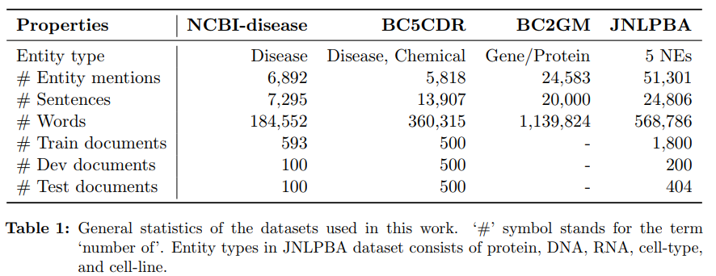

# Effective Use of Bidirectional Language Modeling for Transfer Learning in Biomedical Named Entity Recognition

* char + BILSTM のみ
* ただし、NERにどのデータセットを用いたかだけ、大変重要なので記載する。

* "NCBI-disease BC5CDR BC2GM JNLPBA" の4つを使用
* 
* あとは特に目新しいものは無し。
