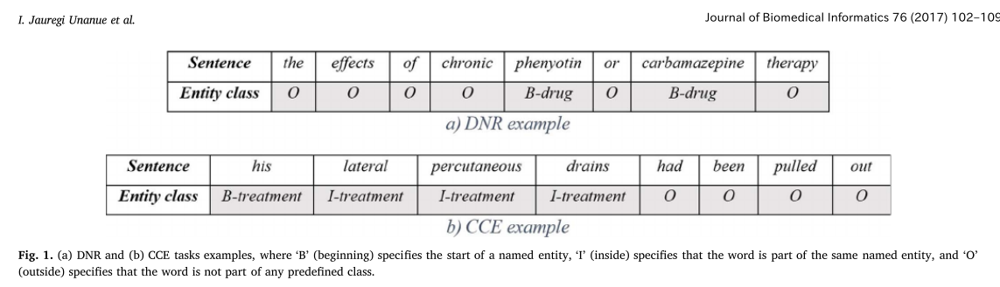
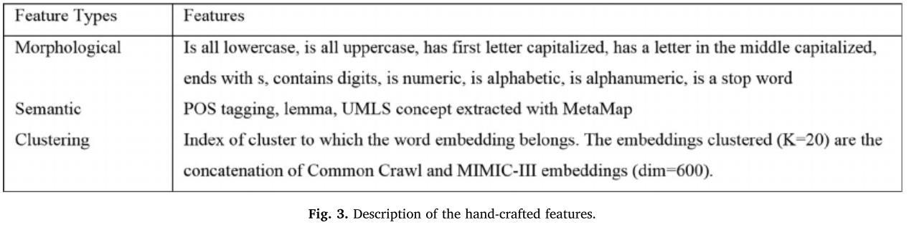
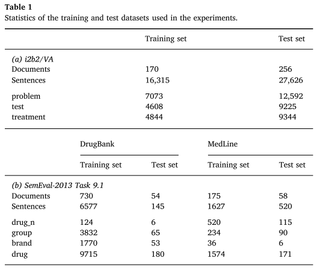
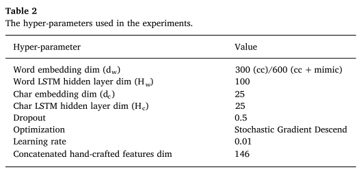

# Recurrent neural networks with specialized word embeddings for health-domain named-entity recognition
* 特徴量エンジニアリングによるアプローチはtime-consumingであり、時間もかかる。

## Abstract
 * これまでのclinical concept extraction やDrag name recognitionでは、特徴量エンジニアリングやSVMとの組み合わせでしかなかった。

* より密度の高い、エンベディングを、MIMIC3などのデータセットを用いて得る。
* 現存する３つのデータセットを用いて、この論文で提唱するモデルを評価する。

## Method
 BiLSTM, BiLSTM-CRF の２つを用いて評価

## Results
 BiLSTM-CRF が最も良い精度

## 本文メモ

### 1.Introduction
 * Health domain においてnamed entity recognition がなぜ重要かというと、Clinical concept extraction 及び、Drug name recognition の２つである。
 CCE に置いては　names, treatments, problems related to individual patients,などの例があり、
 後者のDDI についてはbiomedical text からのdrug mention の抽出がそれに相当する。

 

 * たいていの場合brute force またはルールマッチングで成されてきた。しかしその手法を取ってしまうとtime-costlyであり問題である。つまりルールマッチだと、高い確度でもって得られたものをdrugであると
 認識することが可能なのは容易に想像がつくけれども、それ以外の多くのdrugをmissしてしまい、recallが
 著しく低くなる。

 * これまでは特徴量エンジニアリング、機械学習を用いてなんとかやってきた。その後にembeddingの時代がやってきて、wikipedia, mimic 3 などのそもそもアノテーションがない大量のデータから埋め込みを獲得するという手法が取られた。

 * こうすることで、例えば、薬の文字のサフィックスなどの特徴を自動的に学習した埋め込みを得ることが可能になる。

 * この研究は、先行研究[11],[12]のモデルを、埋め込みとモデルについて拡張したものである。

### 2. Related works
 Deconourt[18]らによるDe-identificationの達成などの歴史が最初につらつらと書かれている。

 * In a work that is more related to ours, Jaganatha and Yu[22] have employed a Bidirectional LSTM-CRF to label named entities from electronic health records of cancer patients.

 * Gridach[23]もLSTM-CRFをbiomedical domain のNERに使用している。

### 3. Methods
 CRF 及び、　Bi-LSTM の説明がつらつらと。Viterbi-style algorithm についても書かれている。

### 4.　Word features
#### 4.1 specialized word features
* かなり重要なことを言っている。
* pretrain embedding としてはGlove とmimic-3 から得たembedding をconcat したと述べているが、
このままでは、drug , health domain に特有な語に対応するGlove vector を用意することが出来ず、ランダム
なベクトルをアサインすることになってしまう。

* なので、Glove のベクトルをmimic3を用いてre-train したと述べている。

* re-train glove の手法については述べられていない? 要確認

* glove とmimic3のベクトルをコンキャット。ただし、どちらかにしか出ていないものについては、残りの部分は
いつもどおりrandom assign している。

#### 4.2 character level assigin
　先に述べたように、文字エンべディングを使用した場合に、例えばcycline が薬である　といったような情報
をLSTMで捉えることは可能である。

* 全ての文字は最初に埋め込みがランダムに初期化され、双方向LSTMにかけられる。
* 最終的なアウトプットとして、良い埋め込みを得ることになる。

#### 4.3 feature augmentation

* これまでの伝統的なaugumentatioin について述べた後、本論文で用いた手法について述べている
　この論文では, 146 Dim の、　[24]らの特徴量を用いたと書いてある。

----
##### table1 training set

----
#### 5.Results

##### 5.1 Datasets
* the 2010 i2b2/VA IRB Revision 使ったは良いがすでに配布されていないとの注意書き

##### 5.2 評価指標
* standard BIO tagging を用いている
* 本筋とは関係ないが、BIOtagginについて詳しく書かれている。

* 折角なので、ここできちんと読んでおく、NERを行う上でも重要なので。
* tagging は word level 単位で行う。
* B : beggining
* I : inside
* O : outside
* entityが正しい予測であると見なされるのは、BI とそれに属するクラスが正しいと判断された場合に限る。

##### 5.3 training におけるデータセットの分割とhyper parameter について

* LSTM の隠れ層の次元と、embeddingの次元、learning rate, とdropout rateについて、epoch数についての詳細な指定が書いてある。。

##### 5.4 Results
###### 5.4.1  Clinical concept extraction over the i2b2/VA Datasets
* Even though mimic embeddings do not cover significant extra vocab, they may have enriched the feature space
* 本当か？可視化について述べられていない。

* この論文ではf1で評価している。スパンのf1 であることに注意する。

##### 5.4.2 drug name recognition
 結局のところ、CRF は弱くNNは強いということがわかった。

#### 6.conclusiion
* mimic3 とcommon crawl のembedding と、character embedding, これまでの特徴量エンジニアリングとを組み合わせて、結局のところBi-LSTM-CRFが一番精度が高いということがわかった。
* handcraft な特徴量を加えても、あまりパフォーマンスの改善には繋がらないということが分かった。

## 次に読むべき引用文献
[22],[11],[12],[18]
