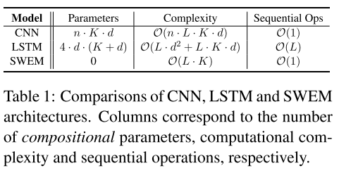
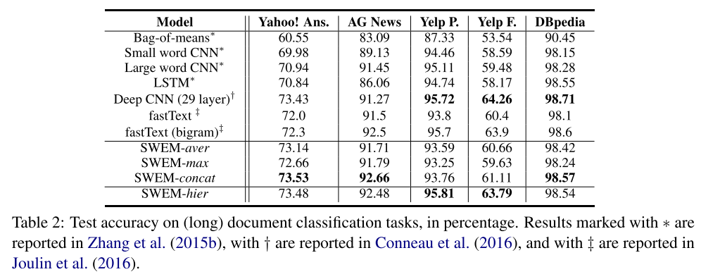

# Baseline Needs More Love: On Simple Word-Embedding-Based Models and Associated Pooling Mechanisms

## Abstract
* Deep かつ　複雑なアーキテクチャを用いたモデルの付加価値について、厳密な評価は成されていない。
* この論文では、単語埋め込みに基づくRNN,CNNと比較して、ただのpooling操作 のSWEMモデルとを比較する。

* 2つの代表的なpooling操作をここでは提示する。
  (1) max pooling (2) hierarchical pooling の2つである。

* タスクは (i) text classification, (ii) sequence matching, (iii) short text tasks, including classification, and taggin の3つで評価した。

* ソースコードあり

## 1. Introduction
 Embeddingによって成功してきたタスクの歴史が並べられている。

* 単にembeddingをaverageしたり、max pooling したりといった操作は、系列の情報を捨てるなどの損失はあるが、学習パラメータ数を削減できる大きな可能性を秘めている。
* つまりここに、計算量 vs 表現豊富性　のトレードオフがある。

* 本論文では、extensive experimentsとして、いつ、なぜ、ただ単純なpooling 戦略がタスクにとって十分な情報を持ちうるかを調査する実験を行っている。

* 種々のデータセットとタスクを用いてSWEM-based modelの評価を行う。ただし、系列情報がどのようなタスクに置いて要求、必要とされるかを理解するための実験も行う。

* テキスト分散表現を用いるタスクでは、多くのwordが最終予測にfullyに寄与していないということが分かったので、max-poolingを文章行列にかけて、textの最もsalientな特徴を引き出そうと試みた。

* max poolingはinterpretable であることを強調

* hierarchical pooling strategy も取ってみた。

## 2. Related work
 pool操作を系列的に追って調査したことと、hierarchical pooling について調査したことの二点を、本論文では売りにしている。

 * simple vs computational の調査を、その理由とともに示そうとしたことが、本論文の寄与である。

## 3. Models and training

embedding のsequence としての文章を、固定長のベクトルに変換する説明の後、個別のfunctionの説明に入る。

### 3.1 Reccurent Sequence Encoder
LSTMの説明

### 3.2 CNN
この実験では単layerのみ、ただし、DeepなCNNの例も紹介されている。

### 3.3 SWEM
 element wize average により文章ベクトルを取得する方法について。
 max-poolingについては(2)式を参照すること。

* 著者らは、SWEM-aver と　SWEM-max は互いにcomplementするものと主張している。

### hierarchical pooling

* SWEM-aver/max はどちらも系列順序を考慮していない。

* window size を指定したmax pooling をhierarchical pooling と著者らは考え、これをSWEM-hierとする。

* This strategy preserves the local spatial infor-
mation of a text sequence in the sense that it keeps track of how the sentence/document is constructed from individual word windows, i.e., n-grams.

* 発想はn-gramに似ている。

### 3.4 parameters

## 4 experiments

* GloVe の初期化とその他learning rate などのsetup, unk について述べている。

### 4.1 Document categorization
LSTM,CNNに劣らないhigh performanceを獲得している。

#### 4.1.1 Interpreting model
 * SWEM-maxによって学習されたembeddigはsparseであることが多かった。
 * GloVe word embeddigs はdenseであった。
 * よって、結局のところ、predictionに寄与しているのはほんの数語に過ぎないということが示唆される。なぜなら、max-poolingによって殆どのwordは潰れてしまうので。

### 4.2 Text sequence matching
 * 特にsentiment analysis に限れば、CNN,LSTMよりもSWEMの方がhigh performance たりうるということが判明した。

 * 一方で、SWEMで系列の情報を潰しているために、パフォーマンスが著しく低下するデータセット、Yelpなども存在した。

### 4.3 SWEM-hier
  * 他のSWEMよりも優れていることを述べている。

### 5章　discussion
　* 省略

### 6　Conclusion
　* 単純なプーリング操作でも、長い系列長の文章を表現し得るが、短い文章の場合は　recurrentな方が良い

* sentiment analysis の場合は SWEM-poolがLSTM,CNNに劣らない性能を発揮した。

* 単純なプーリング操作でも、テキストの同義語や回答の選択に置いて優れたパフォーマンスを発揮する。

* 最大プール操作を行うSWEMでは、word embedding の各次元に解釈可能な意味パターンが含まれ、共通のテーマまたはトピックを含む単語がグループ化される。
