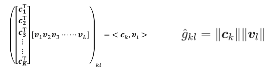
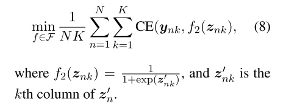

# Joint Embedding of words and labels for text classification

#### MIMIC3 のタスク理解も含めてもう一度読み直す

## Abstract
 * attention framework の導入。ただし、このattention は通常のattention ではなく、labelとtext 系列間のcompatibility を表す　Attention
 * 系列長テキストが与えられた場合、labeling を最も関わる深いword に重くattentionがつくモデルを提唱している。

 * モデルの解釈性も保持しているので、医療テキストにも用いることが可能である。

## 1. Introduction

* 普通では珍しい？text classification を導入に用いている。

* 系列テキストの分類には、良いtext representation を得ることが必要不可欠である。

 * traditional にはn-gram その他のhand-craft feature が用いられてきた。(インターンでもここまで止まりであった。)

 * CNN + LSTM が着つつある。

 * attention は、タスクに特化したdependencyをcaptureできるようにtrain される。

 * 一方で、word embeddingそのものの密度、richnessにも、テキスト分類タスクは大きく依存する。

 * baseline needs more love について、Li(2018)らの結果も見ておく必要がある。

 * simple model, interpretable model の重要性について述べている。

 * Intro まとめ
 　low computational cost, capture dependencies to task, directly use label informatioin

### 1.1 Our contribution
* label embedding をモデルに取り入れた。

* label embedding frameworkの長所として、

 (1):labelとembeddingについて、同じjoint space内にてembeddingを得る

 (2): model のinterpretebity も保持している。

 (3):attention について、パラメータ数が従来より少ないことと、計算量が少ないことを売りにしている。

 (4):分類タスクでSoTA

 (5):clinical text へ応用し、attentionによって医師の負担を減らすby-productも得た。

## 2 Related work
 * そもそも、image classification task においては、label embeddingによって分類精度を上げる手法は取られていた。(Akata 2016)

* 一方で、label同士のcorrelationをsebedding space内で捉えるzero-shot learning もまた、これまで捉えていないclassの予測精度の向上に寄与していることが明らかになっていた。　（Ma et al 2016）

* ただこれまで、attention model と label embedding とを組み込んだ手法というのは、提案されてきていなかった。

* attention model の成功について、Vaswani 2017 らの文献を筆頭にその歴史が紹介されている。

* 読まないといけない論文　Vaswaniu 2017, Shen 2018

* 本論文では、word-label間のattentionについて調べ、またLEAMがparameter数が少ないことを実証した。

## 3 Preliminaries

  * 0 / 1 lossを例に説明すると、予測するラベルは一つとは限らない。one-hot かもしれないし、後述4.1 での "binary vector" であるかもしれない。マルチラベルが一つのデータにつくこともある。

  * $f_0,f_1,f_2$ についてそれぞれ以下のように定義している。

  $f_0$ : one-hot 文章行列から、vocab 文章行列に飛ばす操作

  $f_1$ : 文章行列をfix長のベクトル $\boldsymbol{z}$ に変換する操作

  $f_2$ : fix長文章ベクトルを、classifierに掛けるため、 $\boldsymbol{z}$ をlabel, multilabel $\boldsymbol{y}$ に変換する操作

   $f_0,f_1$  については　word2vecの例を挙げるまでもない。

### max pooling の重要性について
 "simple manipulation of the word embeddings, e.g., mean or max-pooling, can also provide surpris- ingly excellent performance (Joulin et al., 2016; Wieting et al., 2016; Arora et al., 2017; Shen et al., 2018a)."

 ** Baseline needs more love  を読むこと。**

## 4. label embedding attentive model

### 4.1 model

通常の $f_0,f_1,f_2$ に対して著者らが提唱するのは

* $f_0$ : 通常のword埋め込みに加えて、labelも同じ空間内に埋め込む操作を行う。これはanchor points と著者らは読んでいる。

* $f_1$ : label-word 間のcompatibility を加味しつつ文章行列をfix長のベクトルに変換する

* $f_2$ : label にベクトルを飛ばす操作。ここはこれまでのものと同じである。

 Compatibility 行列から attention を作る操作については以下の通り。

 

 * 上図のcompatibility行列に、ウインドウサイズを指定してReLUしてmaxpooling, softmaxを経てattention vector $\boldsymbol{\beta}$ を得る。このattention を用いて、最終的な固定fix長文章ベクトル

  $$ \boldsymbol{z} = \sum_l \beta_{l}\boldsymbol{v}_l$$

 を得る。

### Relation to Predictive Text embeddings
  PTEとの比較を述べているが、ここでは省略する。

### Trainする目的関数
 1-label か、　1-sample/multi-label 問題かで別れる。

 * single label problem
  この場合は通常のCross Entropy　を取ることになっている。

 * multi-label problem
  この場合は、一つのサンプルに対して、どれだけラベルをつけていいかという制限数がないので、(8)式のように、全ラベルについてCross Entropy を取る。

### 4.2 Learning , Testing with LEAM

* 各ラベルについて、そのembeddingは、各クラスにおけるanchor point足りうることを期待する。すなわち、同じクラスに属する近い言葉、分散表現に近い埋め込みをlabel embeddingが得てほしいし、また逆に、異なるクラスからは遠いembedding を labelが得ることを期待する。

* 上記の性質を獲得するために、(9) 式のような正則化項をlabel embeddingにimposeして学習させる。

## 5. Experiment Results

### Setup
 実際の初期パラメータなどの詳細がここに書かれている。unk wordの初期化をどのようにしたかについて　等。

### application to clinical Text
　今すぐに実装しないといけないのはこの部分で、AUC,f1,attentionの実装を今すぐ行うこと。

## 次に読むべき論文
Wang et al 2018 Wenlin Wang, Zhe Gan, Wenqi Wang, Dinghan Shen, Jiaji Huang, Wei Ping, Sanjeev Satheesh, and Lawrence Carin. 2018. Topic compositional neural language

Dinghan Shen, Guoyin Wang, Wenlin Wang, Martin Renqiang Min, Qinliang Su, Yizhe Zhang, Chun- yuan Li, Ricardo Henao, and Lawrence Carin. 2018a. Baseline needs more love: On simple word-embedding-based models and associated pool- ing mechanisms. In ACL.
Dinghan

Akata et al 2016 Zeynep Akata, Florent Perronnin, Zaid Harchaoui, and Cordelia Schmid. 2016. Label-embedding for image classification. IEEE transactions on pattern analy- sis and machine intelligence.

Ashish Vaswani, Noam Shazeer, Niki Parmar, Jakob Uszkoreit, Llion Jones, Aidan N Gomez, Łukasz Kaiser, and Illia Polosukhin. 2017. Attention is all you need. In Advances in Neural Information Pro- cessing Systems, pages 6000–6010.

Tao Shen, Tianyi Zhou, Guodong Long, Jing Jiang, Shirui Pan, and Chengqi Zhang. 2018b. Disan: Di- rectional self-attention network for rnn/cnn-free lan-
guage understanding. AAAI.

Tao Shen, Tianyi Zhou, Guodong Long, Jing Jiang, and Chengqi Zhang. 2018c. Bi-directional block self- attention for fast and memory-efficient sequence modeling. ICLR.
Haoran
