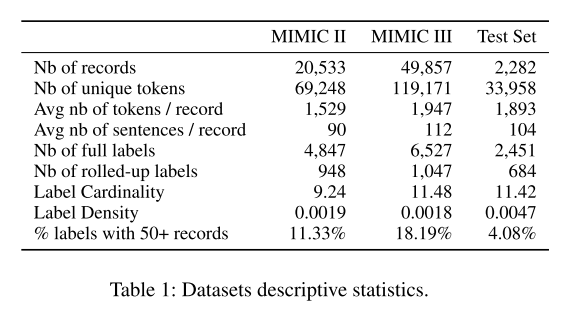

# Multi-Label Classification of Patient Notes: Case Study on ICD Code Assignment
## published 2017/9 被引用数 7

# Abstract

* diagnosis code から自動的にcodingするタスクはEHR界隈で有用なタスクではあるが、患者のnoteの長さであったり、codeの数が多いということで困難なタスクの一つである。

* discharge summaries に対して、多数のICD-codeの割当を行うモデルを4つ作り、mimic2及びmimic3 のデータに対して試した。

* Hierarchical Attention bidirectional Gated Recurrent Unit がSOTAを達成したことを報告。

* 更に、attentionによって、タスクが予測を行う際の根拠を明示しており、このhilightから、今後の改善する道筋も見えてくる。

## Introduction

* そもそもEHRにmultiple label をあてがうタスクの歴史についての導入から始まっている。
* 14000 ICD-9 code及び68000 ICD10 codeの中から、多数のラベルを付与するタスクである。

* 本論文では、非構造なデータであるEHRに焦点を当てる。

　問題設定について

(i) very large label Datasets
 * 6500ものunique なICD-9 code及び、1047もの3-digit unique ICD9 code が存在

(ii) 1instance に対して、マルチラベル up to 20 までを付与するタスク

(iii) instance は long documents

(iv) 更に、長文を扱うがゆえに、 *tranceparency* が求められる。つまり、ラベルがついた、予測精度が上がったとしても、その説明に根拠がなくてはならない。また、モデルに解釈性があることが望まれる。

本研究に置いては
* SVM 1-vs all
* CBOW
* conventional neural network (CNN)
* HA_GRU
の4つについて比較し、検討している。

"A characteristic of the healthcare domain is long documents with a large number of technical words and typos/misspellings."

本研究では、簡単かつ、効果的な前処理についても述べていることに注意されたい。
また、本論文で一番売り出したいのは言うまでもなく、HA-GRUである。

## Previous work
### multi-label patient classifications
とてもありがたいことに、この論文では、患者の記録に対してマルチラベルを付与するタスクを、更に4つに分けて詳細に述べている、以下にその詳細を記述する。

#### Diagnosis Code Assignment
* そもそも、automated ICD coding 自体がすでに確立されたタスクの一つである。
* これまでSVM, bayesian ridge regression, K近傍法などを用いた予測がなされてきた。
* ここに出されている先行研究は、mimic3 でないデータセットを用いている以上、容易な比較は出来ない。
* ICD-9 code と、rolled-up  ICD-9 codeとは別らしい？

* 本論文では、assign されたコードの根拠となる部分にhilight を当てるところまで実現している。

#### Patient Record labeling
Harutyunyan 2017らのmulti-task learningについて参照せよ。

#### Predictive Model
 これまでのmulti-label classification については、predictive modelが主であった。Deeppatient,DoctorAIなどの例について述べられている。

#### Input to Multi-label classifications
* たいていのmulti-label classification task については、まずinputを構造化するところから始まっている。
* Survival filter の例　よくわからない。
* 今回の手法では、input はtextのみ。
先行文献について、2016 Demner 2016 Jagannatha を参照すること。

### Multi-label extreme Classification
* 今回のタスクは、そもそもの付与しうるlabelの量が圧倒的に多いことがキモ
* health domain ×　large labelingという観点からの先行研究をいくつか紹介している。
* 少し気になるのはChoi et al 2016 のQA

* 一番最初に、very large label set問題に取り組んだWeston et al 2011 についての紹介。

* Westonらの問題は imageに対して、image と　labelをともに、shared low dimension vector space に埋め込み、ulti-label problem をranking 問題に定式化して取り組んだ。　このときにloss はHamming lossを用いた。

* scale に対して十分速い速度で学習が進んだ。

* 今回の評価指標にはmicro-F が適切であると考えた、なぜなら,imageのlabeling予測ほどapproximate な予測では駄目だからである。

* その他、SLEEC,Fasttext-CBOWを用いたモデルの先行研究について述べられている。これを受けて、本研究でもCBOW をbaselineとして上げている。

## Dataset and Preprocessing
この論文では、preprocessingについて述べていることが大変ありがたい。

* mimic2 と mimic3 の両方について、train,testにsplitした。
* mimic2,mimic3にはoverlapするデータも多い。

### MIMIC Datasets
* MIMIC2には、MIMIC3に含まれているaddenda to the dischage summaries が無い。
* 実際には、ICD-9の予測にcrucialなaddendaの中に含まれていることがわかったので、今回はconcatnate した。
* table 1 を見てください。

### ICD9 codes
ICD9の情報について書いてあることはありがたい。
*

### 次に参照すべき論文
[Demner Fushman and Elhadad 2016] Demner Fushman, D., and Elhadad, N. 2016. Aspiring to unintended conse- quences of natural language processing: A review of recent developments in clinical and consumer-generated text pro- cessing. Yearbook

Jagannatha, A. N., and Yu, H. 2016. Structured prediction models for RNN based se- quence labeling in clinical text. In Proceedings ofthe Con- ference on Empirical Methods in Natural Language Pro- cessing (EMNLP), 856
