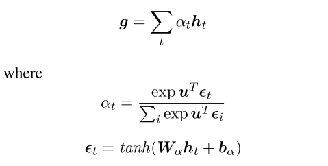

##　Abstract
* BiLSTMが持つ欠点を、各wordに対してpararell state を持たせることで解決しようとした。

## 1 Introduction
* 文章encodingの歴史とその利点について、bi-LSTMの紹介を中心に述べられている。
* 機械翻訳、言語モデルなど様々なタスクに置いて、SoTA を達成しているにも関わらず、Bi-LSTM はその制約に苦しんでいる。
* 特に、長い系列間の依存関係を捉えるのに向いていない[Kohen and Knowles 2017]

* 根本にある考え方は、全ての言葉が持つ隠れ状態を同時に、各recurrent step でモデル化するということにある。普通のLSTMでは、系列的に、つまり　one word at at time でモデリングしている。
* 全文を一つの状態として捉え、その一文の中に、サブ状態として各word 、そして overall sentence-level stateが含まれていると考える。

* S-LSTM では 3-6 recurrent stepsのみで、効率的なsentence encoding を得ることが可能になる。一方で、Bi-LSTMではword 系列長の分だけrecurrent steps が必要となってしまう。この論文の売りの一つはこのrecurrent steps が少ないことにある。

## 2 Related work
* LSTM encodingの歴史について
* BiLSTMとS_LSTMが共通している部分もある。どちらも双方向の流れを加味するが、状態遷移については異なっている。

* text のCNN encodingについても述べられている。Sabour et al 2017らは、CNNのmax pooling が情報のlossを引き起こしていることを指摘している。2017年の論文で要確認

* S-LSTM では、
'''
S-LSTM
uses a global sentence-level node to assemble and
back-distribute local information in the recurrent
state transition process, suffering less information
loss compared to pooling.
'''

* Attention の歴史についても述べられている。特に、HIerarchical attention と stacked CNN との類似性について言及している。

* S-LSTM が graphから影響を受けていることを述べている。

* (Bastings et al., 2017; Marcheggiani and Titov, 2017)

* この論文の最大のウリは、文章をencoding する初めてのgraph RNNを提唱したことにあると、著者らは述べている。

## 3 Model

 * $\boldsymbol{s} = w_1,w_2,..., w_n$ ただし $\boldsymbol{s}$ は一文で、 $n$ は文章系列長さ、 $i$ は $i$ 番目のword であるする。

  * 最終的には、各word input $w_i$に対して、隠れ状態 $\boldsymbol{h_i}$ が得られていて、かつ global sentence hidden vector である　$\boldsymbol{g}$ が得られていてほしい。

  * 文頭、文末の記号も加えて、$w_0, w_{n+1}$ とする。

### 3.1 baseline bi-LSTM の提唱
 * baseline となるBi-LSTM について簡潔に紹介している。
 * 簡潔な紹介ではあるが、重要である。特に、本論文の提案手法であるtime-step t と混合してはならない。

 * 最終的な文章ベクトルは、bi-LSTMの場合、 各方向について系列を通して得た隠れベクトル　$\overrightarrow{\boldsymbol{h}^{n+1}} , \overleftarrow{\boldsymbol{h}^0}$ をconcat することで sentence hidden vector $\boldsymbol{g}$ を得る。

 ### 3.2 Sentence - State LSTMの場合
* 各 time step 状態において、 S-LSTM state は以下のように表記される。
 $\boldsymbol{H}^t = \langle \boldsymbol{h}_0^t , ...  \boldsymbol{h}_{n+1}^t,  \boldsymbol{g}_t \rangle$

* $\boldsymbol{h_i^0}$ は文章系列の初期パラメータ

* 各time step $t$ における $\boldsymbol{g}^t$は結局のところ1 time step 前の $t-1$ における　$\boldsymbol{h}_i^{t-1}$ for all  $i \in [0 ... n+1]$

* 結局、Bi-LSTM とS-LSTM との違いは何か? Bi-LSTM はあるwordに注目した場合、beggininng(またはend)からそのword までの間の系列しか考えていないことになるが、S-LSTM の場合は、sentence-sub state と word level sub state の両方を同時に、文章全体に渡って考えていることになる。

 * S-LSTM の場合は、双方向のflow に加えて、time-step が増えると、あるword について、tが増えるごとにより多くのn-gramを考えることになる。

 * 結局,S-LSTM はBiLSTMよりも効率的で、より正確な文章表現を得ることに成功している、と著者らは述べている。

#### Increasing window size
 * window size を増やす実験も行っている。

#### Additionak sentence-level nodes (?)
 * In addition, diffferent sentence-level node can communicate with each other during state transition. ←　よくわからない。

### 3.3 task settings
 * 文章分類タスクの場合、 $\boldsymbol{g}$ を線形変換したものを、つまり、classification layer に通したものをsoftmaxに掛ける。
 * ここで、output の $\boldsymbol{y}$ は、各ラベルについての確率分布である。

 * もし、NERなどのsequence labeling を考えるのであれば、各隠れ状態の $\boldsymbol{h}_i$ を特徴として与えることになる。

#### external Attention
 * attention の導入についても、その歴史と一緒に紹介し、本手法でも取り入れたと書いてある。

 

 #### external CRF
 * CRF も導入

##4 Experiments
### 4.1 Datasets
  * 分類タスクとsequence labeling についてそれぞれ別の物を用意して比較している。POStaggingについて、CoNLL をベンチマークに用いている。

  * CoNLL のNER については、BIOES scheme を用いて評価を行っている。

#### Hyperparameters
 * dropout, Glove の次元について、正則化項について述べている。

### 4.2 Development Experiments
 * movie review dev data を用いて、S-LSTM及びBi-LSTMの種々のconfiguration について実験を回しているのが Table 2
* sentence-level node が無いと精度が落ちるかを確認する実験　table 2
* 4.2 はdevelopment experiment であることに注意する。データセットもdevを用いた実験であって、本番ではない。モデルの大枠は定まっているが、詳細なパラメータについてどれが良いかを見に行くための実験であって、本実験ではないことに注意する。

### S-LSTM vs Bi-LSTM
　* devの実験で、2-layer stacked Bi-LSTM よりも良い精度をすでにS-LSTMが出していることに注目すべきである。
 * stacked CNN と hierarchical CNN の2つについても、dev実験としてまず実装し、比較している。

#### Influence of external attention mechanism
attention は Bi-LSTM, S-LSTM のどちらにおいても、dev 実験で正解率の向上に寄与したと書いてある。

## todo
### 再実装する

## 次に読むべき論文
Sabour 2017
