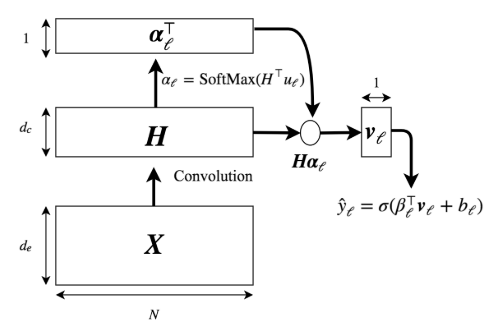
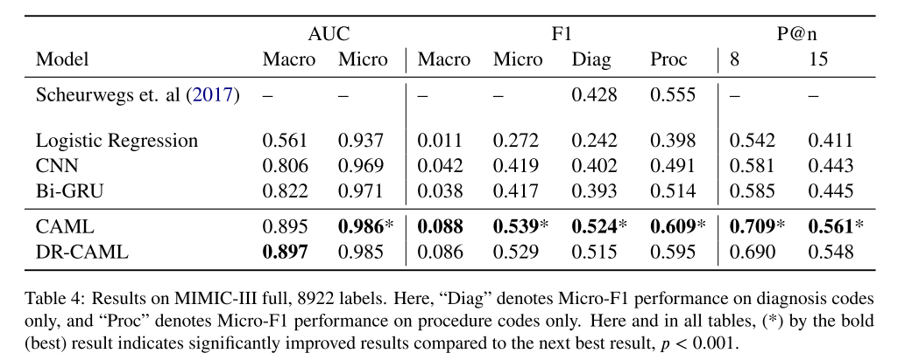

# Explainable prediction of Medical codes from clinical text

## Abstract
* ICD code のアノテーション自動化自体に価値がある
* この論文ではattention + CNN を仕様
* precision@8 評価指標で0.71, micro-f1で0.54
* attention を用いて、診断コードを充てる根拠も明示

## 1 Introduction

* ICD-9 code だけで15000コード存在している。
* ICD-1o-CM, ICD-10-PCS まで加味すると、140,000コード存在している。

* この論文では,CNN-based のcode-assignment機構を提案する。CAMLと命名
* MIMIC3 を用いた検証を行った。
 MIMIC3
   各記録に対して、narrative notes が存在し、診断状況や処方等もそこに含まれている。
* 今回の手法はmimic2,mimic3の先行研究でのicd予測より優れている。
* この手法にattentionも統合することで、診断士のanotationの手間を減らすことも可能である。

* ICD-9 のコードを充てる精度を挙げるだけでなく、説明根拠も明示しなくてはならないので、簡潔なモデルかつattentionを用いた判断根拠明示を行った。

## 2 Method

* ラベル次元に置いてonehot化、すなわち、
  ラベル空間　$\mathcal{L}$ に対して、　全てのラベル　$l \in \mathcal{L}$ であって、各インスタンス　$i$ この場合のインスタンスは患者のノートであるが、このインスタンスについて、全てのICDラベルについて $y_{i,l} \in \{ 0, 1\}$ である。
* 今回は、Kim 2014らと似ていて、各document のrepresentation を得るために、CNN にテキストを渡す。

* attention をあてがうことで、タスクにとって最も関連する根拠を選択する。

### 2.1 Conv architecturte

* 文章自体は文章行列　$\boldsymbol{X}$ で表される。
* filter 幅 $k$ , filter output $d_c$ , embedding 次元　$d_e$　として

$$\boldsymbol{h}_n = g(\boldsymbol{W}_c  \ast \boldsymbol{x}_{n:n+k-1} + \boldsymbol{b}_c)\tag{1}$$

を得る。 $\ast$ は畳み込み、　$g$はelement-wize nonlinear transformation を表す。
* padding あり。

最終的な構造は、fig 1 のとおりである。

### 2.2 attention
* Kim 2014 らの研究にもすでに存在しているように、畳み込みした後max pool を掛けて、各row のmaxまたはaverage を取るというのはよくある手法

* しかし、今回はmulti-label 問題であるので、異なる部分は、別のicd-codeに該当する可能性は十分にある。

* よって、今回は、per-label attention mechanism を採用する。

* この手法のメリットは、label に最も関連するk-gram を取ってこれるという点である。

* (1)四季を並べて得た行列　$\boldsymbol{H}$ について、

$$\boldsymbol{\alpha}_l =softmax(\boldsymbol{H}^{\top}\boldsymbol{u}_l)\tag{2}$$

* このattention vector を得て、　representation vector は

$$ \boldsymbol{v}_l= \sum_{n=1}^N \alpha_{l,n} \boldsymbol{h}_n \tag{3} $$

と表される。ベースラインモデルとしては、ただのmax pooling したものを採用する。

### 2.3 classification

* $l$番目のベクトルがその文書に該当する確率は

$$ \hat{y}_l = \sigma(\boldsymbol{\beta}_l^{\top}\boldsymbol{v}_l + b_l) \tag{5}$$

として表される。

### 2.4 training
* binary cross entropy を用いる

### 2.5 Embedding label descriptions
* label そのものが滅多に出現しないこともあり、WHO のテキストを用いてlabel embeddingの作成を行う手法を取った。

* これらのベクトルはmodel parameter の $\boldsymbol{\beta}_l$ の正則化に持ちいた。

## 3 Evaluation of code prediction
* MIMIC3を用いた。
* 8921 unique  icd-9 , including 6918 diagnosis code and 2003 procedure codes

* 47224 discharge summaries from 36998 patients were used for training

* 1632 summary: validation,, 3372 : testing

### secondary evaluations
mimic2 も、他の文献の手法と、データセットを一致させるために用いました

### preprocessing
 * no alphabetic characters なものを除去、例えば　500 は除去されるが、　250mg は除去されないことに注意する

 * 全て小文字化

 * train 全部を通して3回以下しか出現しないwordについてはunk 化する

 * pretrain word2vec のdim は100

### baseline
* single-layer CNN
* bow
* bidirectional GRU

### Results

