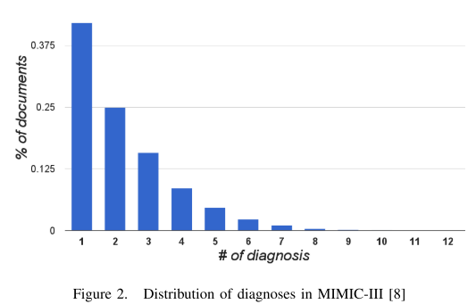
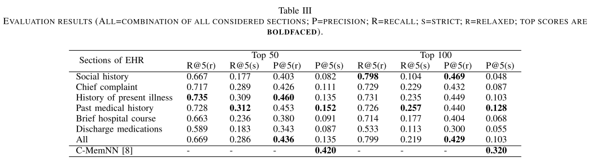

# Automated CLinical Diagnosis : The Role of Content in Various Sections of a Clinical Document

## Abstract

* 自動診断システムを作ることは診断士の負担を減らすことにつながる。
* この論文では、Knowledge-Graph base の自動診断システムを提案する。
* public に使用可能なリソースを用いることで、 possible diagnoses を自動推論するシステムの構築を目指す。

* 本論文の対象はMIMIC3 であるが、MIMIC3 が持つデータの中の、特に "history of present illness" 及び、"past medical history" の2scetionが、推論に、他のセクションと比較して大きな役割を果たすことが分かった。

* 他の　sota deep 手法と比較する。

## 1 Introduction
 * 今回は　knowledge source として　Wikipedia を用いる。
 * 本論文では、\
   input : free text description of a medical problem　\
   output: most likely Diagnosis \
   とする.

* Wikipedia 内のlink 構造について、 \
  node  : wikipedia 内の各ページ, ハイパーリンク化された概念、リダイレクト先のページ　など　\
  edge : それらの間の関係　\
  とする。

* Knowledge graph 上のクエリシステムを、最もありうる診断の導出が可能なように発展させる。

* 本論文は、SoTAのCondensed Memory Network を用いた、同じmimic3 でtrainされた先行研究と比較する。評価結果では、いくつかの実験に置いて、先行文献より良いパフォーマンスを示した。

本論文の貢献を3つにまとめると

* KG-based clinical diagnosis inference 自体が新しい
* EHR内のどのsectionがinferenceに寄与するかの実験も行った
* sota[8] との比較、優位性

## 2 Related work
 * EHR が持つtextの背景について、大抵、構造化されたdataと、構造化されていないテキストとの2つをEHR は併せ持っている。

  structured data : vital signal, lab tests など
  unstructured text : 診断ノート等

医療のnarratives から診断を推論するタスクは、近年注目されつつある。

 * 重要なことに、このタスクは2種類に分けられる。ICD-9 multilabeling については、multiclass-multilabel 問題であるし([8,14]), document retrieval taskとして捉えることもある。([19,20])

 * document retrieval task として本問題を定式化する場合、ある診断ドキュメント、診断シナリオに対して、データベースの中から、ありうる診断をretrieve するタスクとなる。

 * 自動診断のreasoning の方法としてgraph を用いる先行研究というのは、数少ない。\
   [21]:テキストベースのknowledgeをconceptual graph に落とし込んだ。
   [22]:限られたdisease に限定して、医療知識の分散表現獲得のためにグラフを構築した。

 * そもそも、KGの先行研究の根本思想として、answerはnode あるいはpath である、というものがある。

 * TRECカンファレンスが定義した、タスクの説明: 患者が受ける診断、患者が受けるべきテスト、患者に処方すべき処方の3つを答えるタスク

 * 更に近年では、系列データにRNNを噛ませることで、来る診断の予測を行う先行研究([8],Prakash et al) なども現れてきている。

 では、本論文は既存研究と何が違うのか?

* knowledge graph を構築するという点に置いて、
* hybrid activation-based querying mechanism (?)の導入

* この研究が、EHRのどのsection が診断予測に最もimpactがあるかを調査した最初の論文であると主張している。

## Inferring clinical diagnosis with knowledge graph

実際にどのようにKGを構築するかについて、また、診断narrative と構築グラフからどのように診断を予測するかについて、以下に述べる。

### A. Knowledge Graph construction
* wikipedia 下の clinical medicine category の全てのドキュメントを取得
* clinical medicine category がroot として機能
* root の直近のinitial node としては、このroot 直下にあるページのサブカテゴリがそれに相当する。

* サブカテゴリに対応するノードにはテキストは存在しないかもしれないが、ページに対応するノードには、必ずテキストが含まれている。

* root から、深さ10で深さ優先探索を行った。結果、188139 oages, 17121 sub category  が得られた。

* ページに存在するハイパーリンクに基づいて、更に新しいエッジをつくった。

* 結局、KGは381964node, 1906302 edge を含むことになった。

### B, Inferencing diagnosis
#### 1.symptom extraction
[32] hybrid clinical NLP engine を用いて、症状をテキストから抽出した。また、demographic infomation も抽出した。
また、wikipedia のページに対応させるために。抽出した単語は全てnomalizeされた。

#### 2. Querying the Knowledge Graphs
common symptom とそうでないrare symptomに対して、pubmed コーパス上の出現頻度の逆数をweightとして載せる。

#### 3. Building the solution space
 solution space の構築方法として2つのアプローチを用いた
 a ) building a bare-bone sub space
 b ) expanding the subspace to have a connected path between any two nodes

#### 4 activating nodes in the solution space

* weight のpropagation を行う。ただし、propagateするごとに、伝播するweight は弱まる。

#### 5 Identifying and ranking diagnoses

## 4 Experiments and datasets
### A Dataset
mimic 3 のdischarge summaries を用いた。この図から分かるように、多くの病気はそもそも出現回数が非常に少ないことが分かる。

### B セクションごとの影響の比較
social history, history of patient illness, などの他のセクションが予測に与える影響も調査した。

### C Metrics
 exact word match / relaxed  の2つで評価した。
 実際のところ exact word matchで評価できるかは、怪しい。例えばdiabetesだけでも　db-- など様々な表記が存在するからである。

 P@5によるrelax評価を行った。

### D results and discussion
results

必ずしも各セクション全てが予測精度向上に寄与するわけでは無いことが明らかになった。
KGの改善点などについては、特に述べられていない。

## 次に読むべき論文
[8]
