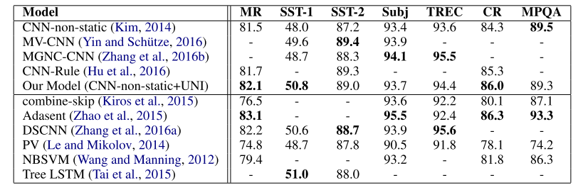

# Initializing Convolutional Filters with Semantic Features for Text classification

## Abstract
* CNN filter の初期化について新しい方法を提唱
* 初期化時において、最初からsemantic feature をencode する手法
* これにより、最初のtrain時から有用な特徴が学習されることの一助になる。

* the lack of data or inappropriate param- eter settings might greatly limit the generalization abilities of the models

* NNが初期のweight によってパフォーマンスが左右されることにも注意せよ

* NLP においては、この文脈上、embedding の初期化もweight の初期化に相当する

* sim-
ple yet effective method to improve CNNs by ini- tializing convolutional layers (filters

* 1-dim conv が良いn-gram を学ぶような初期化を行う　例えば　watch a movie よりも　not so bad 等。

* 検証方法は　Kim 2014 らのtext classification task にて行う。

利点まとめ

* 実装あり

## 2 Related work
* Kim2014 らの糞シンプルな1-d cnn の効果について紹介

* In this work, we encode seman- tic features into convolutional layers by initializ- ing them with important n-grams

## 3 Method
 Since CNNs essentially capture semantic features of n- grams, we can use important n-grams to initial- ize the filters

### 3.1 N-gram selection
CNN filter の初期化に使いたい、使えそうな、有用n-gram をどう持ってくるか

* この計算は要素ごと？　Wang ,Manning 2012 でも同じ書き方

### 3.2 Filter initialization
図のように、　n-gram cluster を weight initialization に用いる。

* n-gram の選択にはK-means を用い、それらのclusterのcentroid vectorをcnn の初期化に用いる。

## 4 Experiments
* baseline Kim 2014

### result

## 次に読む論文
Kim 2014 (baseline)
