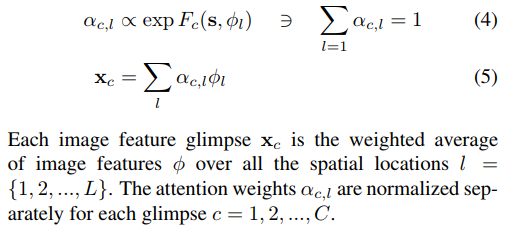
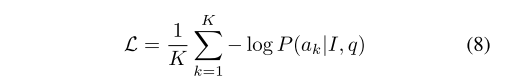
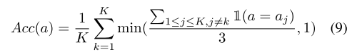
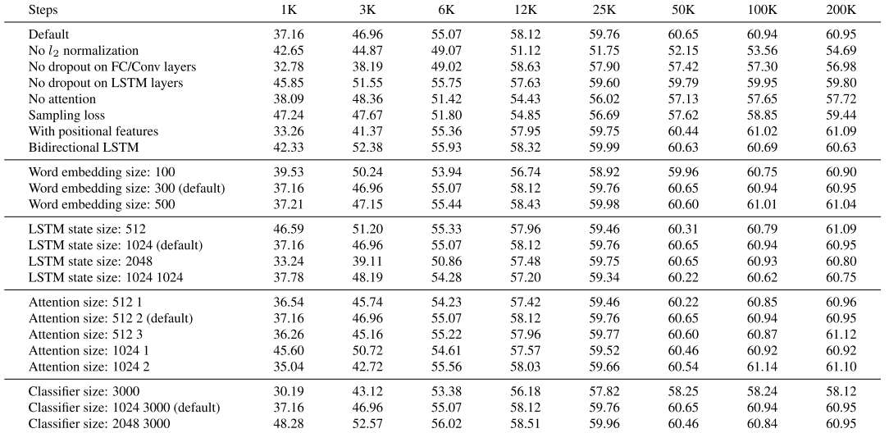

# Show, Ask, Attend, and Answer: A Strong Baseline For Visual Question Answering

## Abstract
* external data を使用しないで、64.6% の精度を達成
(ただし評価指標については要チェック)
* 先行文献で、似たモデルが存在するがパフォーマンスが大幅に低下したとの報告あり。

## Introduction
* image recognition 自体については、すでにhigh acc を達成しつつあるが、image の理解が人間程度になったと言うには程遠い。

* (2017/04)の喫緊の研究課題としては、image caption が存在する。

* caption よりも、VQAの評価は非常に簡単である。
* 非常に限定的な質問をして、モデルに特定の答えを与えるように依頼することは可能

* よって、VQAは自然言語とvision 間を結びつけるrich な表現を得るために最適なタスクと言える　（？）

* [6,22] が面白いVQAモデル

* しかし、我々の手法では、最近のモデルに比べて、極めてシンプルなモデルを提唱する。

* 本手法では、Q のencode  にはLSTM , deep residual network を画像特徴量の導出に使用している。

* 最終精度　64.6%
* "This paper proves once again that when it comes to training
neural networks the devil is in the details [4]."

## 2 Relateed work

* imagenet に深い　CNN を適用した成功例の紹介。

* 異なるドメインにおいて常に有用な手法というものは、少ない。attentionはその数少ない例の一つ。LSTMも同様

* LSTM, attention ともに、すでに　先行研究のVQAには取り入れられている。

* この論文は[32]の手法と非常に似ているが、それでもより良いパフォーマンスの獲得に成功している。また、別のdeepなモデルはこき下ろしている。

## 3 Method
Fig2 を見よ。

  $I$ : image  , $q$ : quetsion ,  $a$ : Answer
  最も可能性のありそうな答え　$\hat{a}$ を、画像の内容に応じて、選択肢の中から選んでくるという問題に落とし込む。すなわち、答え　$\hat{a}$ について

  $$\hat{a}= argmax_a P(a|I,q)\tag{1}$$

  選択肢は　$a \in\{a_1,a_2,..a_M\}$

### 3.1 Image embeddings
 pretrain CNN を用いる

 $$\phi=CNN(I)\tag{2}$$

 $\phi$は三次元テンソルで、最終プーリング層前の残差network からの 14,14,2048 dim tensor

 $l_2$ normalization あり。

### 3.2 Question embeddings
 LSTM にそのまま導入する。 LSTMのoutputは、文章行列ではなくベクトルであることに注意し、質問文　$E_q$ をLSTMに与え

 $$\boldsymbol{s} = LSTM(E_q)\tag{3}$$

 を得る。

### 3.3 Stacked attention
[32] の先行研究に基づき、"Similar to [32], we compute multiple attention distribu-
tions over the spatial dimensions of the image features."

 $F$ の定義は?

* $F$ は実際には、行列であり、　$c \in C$ について、二層の畳み込み層を用いることでモデル化される。
* 多様なattention の分布を生み出したいがゆえに、それぞれ異なる初期化を用いている。

### 3.4 Classifier

 ans label の確率は、以下に比例する

 $P(a_i|I,q) \sim exp\ G_i (\boldsymbol{x,s})$

最終ロスについては、　全ての選択肢についてlog loss を取る。

## 4 Experiments
* Datasets にはVQA1.0,2.0 を使用
* evaluationについては、三人のannotator を考慮した正解率を使用。(9)

その他、この論文は実験settingについてかなり詳細に報告している。
詳しくは論文を参照されたい。

### Results

## 次に読むべき論文
[32]
