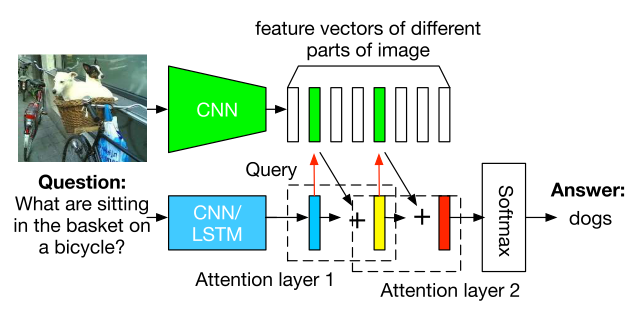
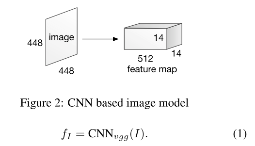
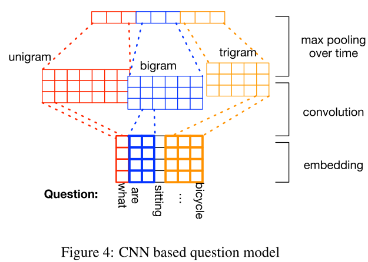
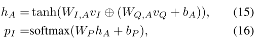
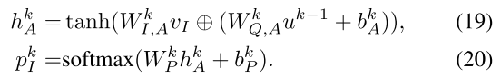
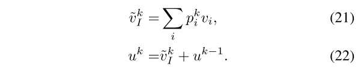
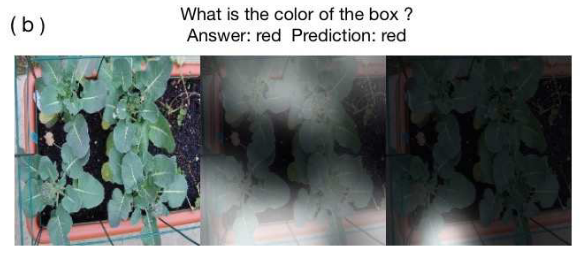
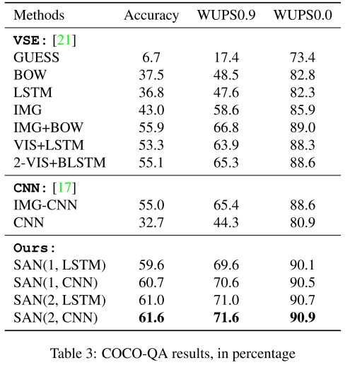

# Stacked Attention Networks for Image Question Answering

## Abstract

* (stacked attention nnetworks)SAN では、質問文の semantic representation を、その質問文の答えに関連する、画像内領域の探索に用いる。

* multiple-layer  SAN では、答えを漸進的に推論する。

* SAN によって、画像領域内のどの部分に注目が成されているかも分かる。

## 1. Introduction

VQA で最もよくある一連の流れは以下のとおりである。

* CNN を用いた、画像→global feature vectorへの変換
* Q→LSTM→vector
* combine them to infer Answer

  著者らは、上のようなひとっ飛びに答えを捕まえに行くアプローチではなく、multi-step な推論こそ必要であると提案している。

* 本論文では、　multi-step　推論が可能な、　attention の拡張版とも言える　SAN を提案する。SANには以下の3つが含まれる。

 * CNN for high level image representation
 * CNN/LSTM for extracting vector from Q
 * stacked attention model (?)

 

the SAN first uses the question vector to query the image vectors in the first visual attention layer, then combine the question vector and the retrieved image vectors to form a refined query vector to query the image vectors again in the second attention layer

本論文の寄与は3つある
 * SAN の提唱
 * 4つのimage  QA set でSANの検証、SOTAの実証
 * SANのmulti-step attentionから見る推論の検証

## 2 Related work

[6] の手法が少し込み入っており、ここでも紹介されている。
 * CNN を用いた、image からのキーワード抽出
 * 言語モデルを用いたcaption のありうるリストの生成
 * deep multimodal similarity sysyem を用いた、候補のreranking

COCOなどのQAセットの大本が何で、どのように作成されたかの記述がある。
 * [19,7] は　LSTMをencoder, decoder に使用している。
 * ただ、著者らは、結局image feature とBOWのocncat がbest model であったと報告している。
 * [17]では、Question modeling にCNN を用い、Qvector  と imagevector のcombine にCNNを用いている。

 * [30]の既存モデルの大幅な拡張が、本手法とも言える。

## 3 Stacked Attention Networks(SANs)
## 3.1 Image models

　feature については、先行文献[21,17,7] と異なり、この論文では、最終pooling層からの特徴量を用いていることを強調している。この特徴量には、元画像のspatial informationが含まれる。

 * 448 \* 448 to 512 \*14\*14
 * 14 \* 14 は元画像の領域の数
 * 512 はその[0,195] の各領域の特徴量ベクトル
 * 各 $f_I$ 特徴量は input image　の32 \* 32 pixel region に一致する。
 * ここでは、各領域の特徴量と、各領域のインデックスを
   $$f_i,i \in [0,195]$$

 * $v_I$ : feature vector matrix ,  $v_i$ : feature vector for the region indexed by $i$

## 3.2 Question Model
　

###  3.2.1 LSMT based question model
 この場合は、LSTM にQ文を突っ込んで、最終隠れベクトルを、質問文の特徴量とする。

### 3.2.2 CNN based question model

 * LSTM と似て、まず最初にword をembedding に変換して 、全てをconcat することで、質問文ベクトルを得る。

  $$x_{1:T} = [x_1,x_2,...,x_T]$$

  * 今回はfilter として、unigram,bi-gram,trigram の3つを用いる。　

    これらのフィルターを用いて得られる、 $t$番目のword のoutput は

    $$h_{c,t}= tanh(W_cx_{t:t+c-1} + b_c)$$

  * 各word にフィルターして、得た特徴量は
    $$h_c = [h_{c,1},...h_{c,T-c+1}]$$

  * convolution size $c$ に対してmax-poolingを特徴量マップに掛けた後では
    $$\tilde{h}_c = {max}_t [h_{c,1},...h_{c,T-c+1}] $$

  * $c = 1,2,3$ に対して得たベクトルをconcat して質問文文章ベクトルとする。

   $$h = [\tilde{h_1},\tilde{h_2},\tilde{h_3}]$$

### 3.3 Stacked Attention networks
 * 大抵の場合、答えに直結するのは、画像の中の　*一部分* 　に過ぎない。
 * もしその場合でも、画像全体のglobal feature vector を使った場合、noise が入ることになる。
 * SAN では、これを取り除けるメリットがある。progressive なreasoning であるので。

image feature matrix : $v_I$  dim は　$[d,m]$\
question vector : $v_Q$  dim は $[d,1]$ \
$d$ : image representation のdim \
$m$ : region 数 \

これを用いて　refine query vector $u$を以下の式で得る。アテンションを用いて、image の中の重要な意味にweight がかたった新しい　$\tilde{v}_I$ を得て、それを　$v_Q$ とcombine する。

* ただし、fig 1 のように、複雑な質問では、一回のattention でキーとなる画像領域を突き止められない場合があるので、attetnion を　$k$thまで拡張し、iterationする。

* attetnion を$K$回繰り返したものをsoftmaxにかけて、数ある選択肢の中での確率分布

$$p_{ans}$$

を得る。

 

## 4 Experiments
 dataset として　DAQUAR-ALL(single word ans),DAQUAR-REDUCED,COCO-QA,VQA を用いている。
 split の仕方については[6] を参照。

### 4.2 baseline and measure
* WUPS evaluation [29]
* baseline [1, 21, 19]

### Result, discussion
attetnion層を重ねることのメリットを主張
COCO-QAのみ載せる。

 

## 次に読むべき論文
[30]

## 実装
実装あり
https://github.com/zcyang/imageqa-san
