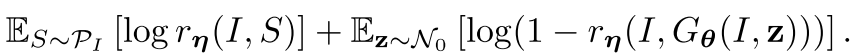
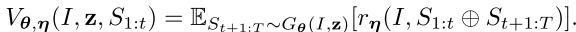

# Towards Diverse and Natural Image Descriptions via a Conditional GAN

## Abstract

* 凄まじい進歩にも関わらず、imape caption の生成はまた完全には程遠い。

* RNN-basedなcaption generation については、trainによって、ground-truth と高い類似性を持つキャプション生成が得意になる一方で、他の似たdescriptionの生成を抑えてしまうという欠点がある。

* この論文では、キャプション表現のnaturalness と diversity を向上させることを目的とする。

* Conditinal GAN に基づく新しいフレームワークを提唱する。

## 1 Introduction

* 直近のcaption generator をベースにした生成キャプションのダメ出しから入る。

* *has the problem
of generating image descriptions been solved?*

* Figure 1 を例に、sota caption generator[29]を紹介。rigid,lacking in vitality.

* これまでのcaption は、fidelity すなわち、画像に対する事実の尤もらしさに注力してきた.LSTM[8]らがその良い例

* 結局、既存のtrain では、train データ内n-gramにきわめて似たキャプションの生成に終止してしまう。

* 既存の評価指標についても、ダメ出しを行っている、BLEU,METEOR,ROUGE,CIDErらは既存のキャプションが生成する、 *safe* な文章に対してスコアをつける傾向にある。

* 極めて単純なことで、人間が生み出すキャプションが、これらの評価指標の前では低いスコアになってしまうという事実そのものが、これらの評価基準の脆弱性を露呈していることになる。

この流れを受けて、本論文では、　*FIdelity, Naturalness,Diversity* の3つを新しい評価基準として提唱している。

かつ、新しいフレームワークとして、conditional GAN を提唱している。
理由として
 * 自然言語の生成は、*sequential sampling* 手続きであり、
 * サンプルは各手続きにおいて *discrete* なサンプルであって、　
 * *non-differentiable*

であるから、と述べている。

これらの問題について、強化学習戦略の一つであるPolicy gradient を用いた解決を試みる。

Introのまとめとして、本論文の寄与を3点にまとめている。

* naturalness まで加味したcaption生成手法の提示
* MLEではなくconditional GAN を用いた
* 人間の評価に近いevaluatorの実現

## 2 Related Work
 Figure.3 に出てくるようなダメ出し。Evaluationの方法や、似た文の似たn-gramに対して、類似系列を吐き出してしまう問題について。

### Our Alternative Way
 * 何度も強調しているように、これまでのtrain sampleの問題点は　resemblance にともきを置いていることであった。つまり、 *safe* ではあるが *limited* な文章ばかりが生成されてしまっていた。
 * 本論文では、その代替手法として、conditional-GAN を用いる。

## 3.Framework
手法 \
  $G$: generator \
  $E$: evaluator\
  $I$: image \
  とした場合に、generatorは、より　*natural* かつ　*semantically  relevant* な説明文生成を行い、 evaluatorは、その文章がどれだけよく画像の説明を成しているかの評価を行う。

* single sentence をまず実験し、次にparagraph generation を行う。

### 3.1 overall Formulation
 * given : $I$ (image)
  この時、$G$は2つのインプット,画像特徴量 $\boldsymbol{f}(I)$ 及び、random vector $\boldsymbol{z}$ をinputとして受け取る。　画像特徴量の関数にはVGG16[26] を採用した。

* random vector &\boldsymbol{z}$
 このinputによって、常に異なる説明を生成する。

* 説明の多様性は、$\boldsymbol{z}$ の分散を調整することにより可能

* sentence decoder としてLSTMを採用

* $E$ : evaluator もまたニューラルネットであり、Gと似ている。しかしその動作は異なる。

  evaluator のinputとして
$$I, S = (w_0,w_1, ...)$$
を考え、これをvectorに変換した
$$\boldsymbol{f}(I),\boldsymbol{h}(S)$$

をinput とする。特徴量への変換は先と同様に画像についてはCNN、文章はLSTM にて行う。

次に、説明の質(quality)について、すなわち、どの程度文章が良く$I$を説明しているかについては、次の内積を考える。

$$r_{\boldsymbol{\eta}}(I,S) = \sigma(\langle \boldsymbol{f}(I,\boldsymbol{\eta}_I), \boldsymbol{h}(S,\boldsymbol{\eta}_S) \rangle) \tag{2}$$

を用いる。ただし、evaluatorのparameter として
 $$\eta= (\boldsymbol{\eta}_I,\boldsymbol{\eta}_S)\tag{2'}$$

 が存在する。$\sigma$ はlogistic 関数であり、$[0,1]$ 内での値を返す。

* CNNと　LSTMはGと同じ構造を持つが、パラメータで結びついてはいないことに注意せよ。

$G$ は、人間がつくった文章と見分けがつかないような説明文の生成を行うように学習させたいと今、考える。
$E$ は、人工生成文と、人間らしい文とを見分けるように学習させたいと考える。

これを定式化した場合、パラメータ $\boldsymbol{\theta,\eta}$ を用いて

$$min_{\theta} max_{\eta} \mathcal{L} (G_\boldsymbol{\theta},E_\boldsymbol{\eta})$$

と定式化される。目的関数　$\mathcal{L}$ は

 

 と定式化される。

ただしここで、$\mathcal{P}_I$  : 画像からの生成文、　$\mathcal{N}_0$ は正規分布、$G_{\boldsymbol{\theta}}(I,\boldsymbol{z})$ は画像とrandom vector $\boldsymbol{z}$ から
生成した文を指す。

### 3.2 Training G : policy gradient and Early Feedback

policy gradient を学習戦略に用いる。この時
conditions : $\boldsymbol{f}(I)$
inputs : preceeding words $S_{1:t-1}$
conditional distributions
$$ \boldsymbol{\pi}_{\boldsymbol{\theta} }(w_t|\boldsymbol{f}(I),\boldsymbol{z},S_{1:t-1})$$

この計算が、LSTM で前にword step ごとに進んでいくことで得られる。
reward は　$r_{\boldsymbol{\eta}}(I,S)$ になる。

ここで、実験上の困難-文章が完全に終わりまで生成されない限り、評価できない-　に対して、early feedback を彼らは提唱した。文章の途中に置いて、将来取りうるrewardについて以下のように定式化される。

 

手法についてはここまで、事件の舞台設定については、一旦省略する。
非常に面白い論文であることに変わりはない。

## 次に見るべき論文
[29],[22],[7]
22: conditional GAN
7 : GAN
34 : GAN for text generation
26 : 今回採用した画像特徴量抽出関数
