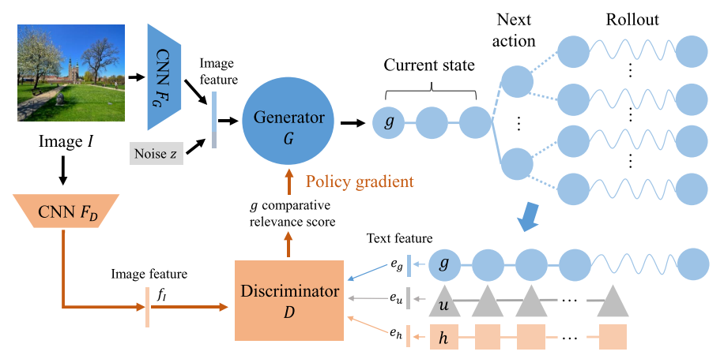
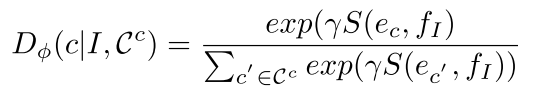
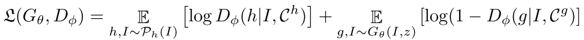
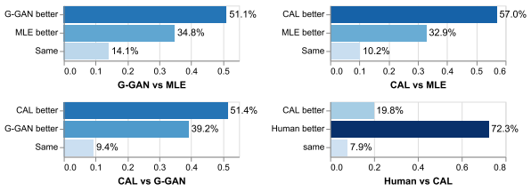
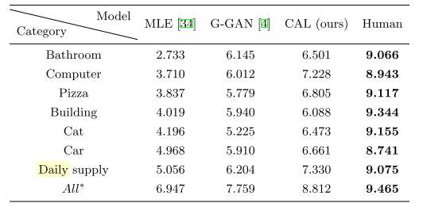

# Generating Diverse and Accurate Visual Captions by Comparative Adversarial Learning

# Abstract
* monotic かつfeaturelessなcaption だけしか生み出せない、既存のモデルの問題点を解決した。

* そのようなcaption は正確ではある。しかし、distinctiveness,diversityに欠けている。

* 提案手法であるcomparative adversarial learning においては、image-caption 連結空間に置いて、caption同士の質を評価する。

* accurate + *discriminative* なcaption生成を行った。

## 1 Introduction
* 既存のcaption 評価指標であるBLER, CIDErについて触れる。

* 既存の learning base methodでは、同じn-gram pattern やよくある(common)　表現の再生成しか出来ないという問題点が存在する。

* 既存の評価指標下の元では、高いスコアを叩き出すものの、 *diversity*　が欠けている。

* [3]　に述べるように、どの画像にも、固有な distinctivenessが必ず存在し、異なる画像には異なるキャプションが付くほうが自然である。

* GAN による diverse caption 生成の可能性[4.5]

* 本論文で提案するのは、GANによる2値分類での、人が書いたか/機械が書いたか　判別器ではなく、別のキャプション同士の比較による comparative learning mechanism を提唱する。

* 既存の評価指標以外の、新しい評価指標の探索も行う。

## 2 Related work
* 既存のものは、maximum likelihood estimation based なものが多い。[6-15]
* [16-18] では、RF

### GAN for language generation
* 既存のGANをsequence generation に適用することの問題点、*However, unlike image synthesis tasks, sequence generation based on GAN encounters gradient back-propagation problem because discrete sequences are non-differentiable*

* policy gradient[21], conditional GAN[4], Gumbel sampler[5] らの先行研究に触れる。
*  *[23] and [4] are the most relevant methods to our
proposed framework.*

* [23],[4]についてそれぞれ、gradient batch normalization 及び、binary discriminator でしかないという問題点の指摘。

### Diversity Metrics
* 言語の多様性について真剣に考慮された評価指標はあるか？

*To our best knowledge, this is one of the first image captioning works that explore the caption diversity characteristics across images in a semantic-level.*

## 3 Comparative Adversarial Learning Network
* min-max game を行う点については、既存の研究に同じ。

$$min_{\theta} max_\phi \mathcal{L}(G_{\theta}, D_{\phi})\tag{1}$$

$\mathcal{L}$ : overall loss function \
$\theta, \phi$ : trainable Hyperparameters \
$G$ : caption Generator  
$D$ : cr-discriminator

* 参照画像　$I$ を受け取り、$G_\theta$ はnoize vector $z$ を生成し、caption $g$ をoutputとして出す。
* 一方で、cr-Discrtiminator $D_\phi$は　*cr-score* : comparaative relevance score
 を正しく見積もることを目的とする。スコアの観点は、human-written caption である　$h$ と、image-caption 連結空間内に置いて相関を持つかで評価される。

 * $G_\theta$ は $g$のcr-score を高め、cr-discriminator である　$D_\phi$ を混乱させるようなキャプション生成に取り組む。

 詳細は以降の章に記述。

### 3.1 Caption Generator $G_\theta$

* $G_\theta$ はencoder-decoder[7]ベース
* $I$ からの特徴量はCNN, text のdecoder はLSTM
* $F_G(I)$ : encoded feature は random vector $z$ とconcat

*  *Since caption generation is a discrete process, the generation process can be considered as a reinforcement problem.*

* *In time step $t$, the caption generator $G_θ$ samples a token $g_t$ from vocabulary $V$ by an action, which is conditioned on the current policy $π_\boldsymbol{θ}$*

* 各word step: $t = 1$ から  $T$ までpolicy 下でのword samplingを行うことで、$t = T$ にてsentence が完結する。

* MLE では、常に　log-liklihood を高めるようなword を選んでいたのに対して、 comparative adversarial training では、　cr-score を高めるような　word を　$G_\theta$ が生成することを期待する。

* discrete token を逐一採取する条件下に置いては、back-propagation を直接行うことは出来ないので、policy-gradient method を採用する。詳細は　3.3

### 3.2 comparative relevance discriminator
* 著者らが一貫して述べていることであるが、*it is more justifiable to compare a
generated caption with other captions, primarily with human-written caption $h$.*

このintuition の下、以下のようにcr-score を定義する。

$\mathcal{C}^c$ : set of captions
$e_c$ : text feature  from text encoder
$f_I$ : image feature from CNN image encoder

$S$ : cosine 類似度
$\gamma$ : empirical parameter defined by validation Experiments

* *Specifically, from the discriminator’s perspective, a human- written caption desires to receive a higher cr-score, whereas a generated caption should receive a lower cr-score (Fig. 3).*

よって、　評価関数は

$\mathcal{P}_h(I)$ : human-written caption distribution given image  $I$.

$\mathcal{C}^h$ : human writtern caption

$\mathcal{C^g}$ : machine-generated caption $g$

### 3.3 policy gradient optimization for $G_\theta$
 * この論文でも、文章が完結しない限り　reward が定義されない点に触れ、　[21] のpolicy gradient を採用している。

### 3.4 discussion
* dirscirminator でtrain する際には、先行文献[4,5] については追加の正則化項が存在する。この正則化項目は、これらの先行文献においては mismatch caption の数を減らすために存在している。

$$Q_{\theta,\phi}(g_t|I,g_{0:t-1}) \simeq \frac{1}{K}\sum_{k = 1}^{K}D_\phi(g_{k,t}|I,C^{g_{k,t}})$$

 更新のためのgradientは論文(7) 式だが、これを理解するためには強化学習の教科書を読む必要がある。

完全な文を待たない条件下での　*intermediate reward* は以下の式で与えられる・。

* この論文では、comparison set  内に人間によって書かれた $C^h$ がそもそも存在しているので、match した image-caption 対 $h, I$ のcr-score を拡張することで、　$D_\phi$ が常に、一致caption を他のcaption と区別することに成功している。

## 4 Experimental settings
### Dataset
 MSCOCO dataset: 123287 images and each one contain at least 5 human-written caption.

### Implementation detail
 ハイパーパラメータ調整など。ここでは省略する。

### Baseline models
(1) MLE : [7] のCNN-LSTM構造をbaseline とする。
(2)G-GAN : conditional GAN [4]を用いた現状SOTAであるモデル。
* [4]のconditional GAN モデルと本論文が異なるのは、caption生成時のcomparative adversarial layouts である。

### Evaluation
Accuracy 及び　Diversity の二点で評価している。Accuracyについては、既存の評価指標に則っての報告であり、Accuracy ベースではこの論文はSOTAではなく、MLE, c-GANと比較して最下位ではあるが、metricsの見直しについては先に述べたとおりである。

* Diversityの評価　にはcaptionの特異値分解により得られる分散を評価基準に用いている。

## 5 results
### 5.1 Accuracy

### 5.2 Diversity

## 読むべき論文
[16-18],[4-5] \
[7] encoder decoer \
[21] 部分policy gradient
