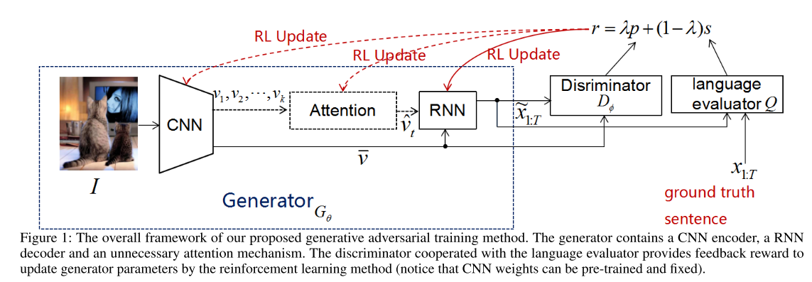
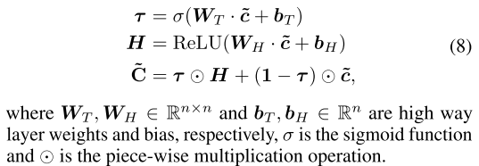
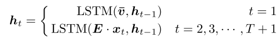
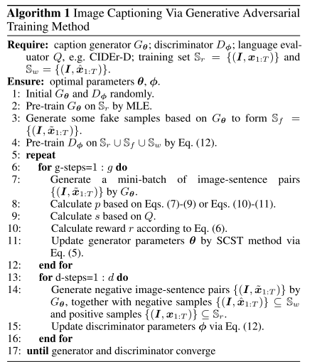
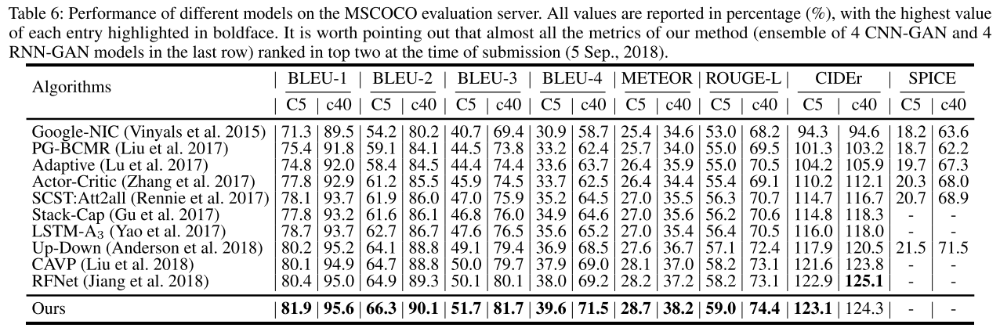
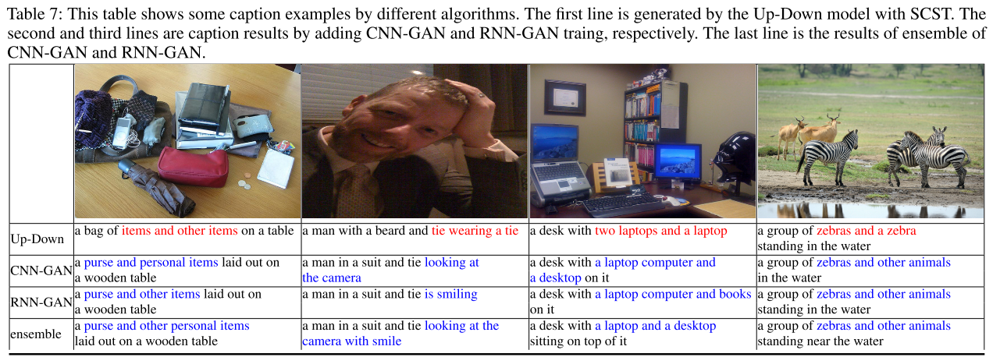

# Improving Image Captioning with Conditional Generative Adversarial Nets

## Abstract
* 本論文では、conditional-GAN ベース　のimage caption について述べる。

* これまでのRL train ベースのキャプションは、この論文の提案手法のspecial case に過ぎないことを述べる。

## Introduction
* RL をimage caption に取り入れた歴史が簡潔にまとめられている。
  * Policy-gradient ベースのimage caption 　導入例としてのREINFORCE
  * Monte-Carlo rollouts
  * actor-critic RL アルゴリズム: Ren 2017, Zhang 2017. "which trains a second “critic” network to estimate the expected fu- ture reward during the intermediate state when generating each word given the policy of an actor network"

* NLP のgeneration task は往々にしてdiscrete process である。
* SeqGANがどの文脈でもたらされたか
* conditional GAN

* 本論文では、human/machine generate の区別を行なうdisciriminator ネットワークの設計に重きを置く。

本論文の主張のまとめは以下である。
 * 提案手法はgenericであり、既存のRLベースのimage caption を支援する機構となる。また実際に既存の評価指標で実験を行い、
   改善を確認
 * discriminator 自身がevaluator とみなせる。　
 * Anderson 2018 のモデルに基づいて、改善されたモデルをMSCOCOテストサーバーで動かし、精度のSOTAを実現。

### Image Captioning Via Reinforcement Learning
これまでのRFベースのimage caption 手法について、簡潔かつ要点を絞って述べてあり、非常に参考になる。
強化学習ベースでのimage caption は、decoder側をagentとみなし、このagentは環境と相互作用する、と捉えることが出来る。
policy は、caption generator $G_{\boldsymbol{\theta}}$ でり、このpoliciyが、次の言葉の予測であるところのactionになる。
各行動を取った後、agentはその内部状態、つまりdecoderのweightであったり、attentionのweightであったりなどを更新する。　これを
EOSが車で繰り返し、　EOSをgenerate した場合、agentはreward $r$を返す。この $r$ は評価指標によって異なる。
 例えばCIEDr,SPICE,BLUE等。

 最終的には、以下の期待値を最大化したい。

 $$L_{G}(\boldsymbol{\theta}) = \mathbb{E}_{\boldsymbol{x}^s\sim G_{\boldsymbol{\theta}}}[r(\boldsymbol{x}^s)]\tag{2}$$

 実際には、期待値はMonte-Carlo sampleによって求められる。すなわち
 $$L_G(\boldsymbol{\theta}) \approx r(\boldsymbol{x}^s), \boldsymbol{x}^s \sim G_{\boldsymbol{\theta}} \tag{3}$$

### 提案手法
文章生成後について、2つのスコアが返される。 \
 $D_{\boldsymbol{\phi}} \in [0,1]$ : その文が、機械による生成文か、人の手による生成分であるかの確率　\
 $Q$ : predefined metrics , 例えばBLEU，CIDEr, SPICE 等。 \

 これら2つのモジュールが、fidelity と naturalness のバランスを取るように協調する。
 センテンスが全てgenerate された後のrewardは、生成文を $\tilde{\boldsymbol{{x}}}$ , ground-truth を　$\boldsymbol{x}$ として、また $\lambda$ をhyperparameterとして

$$ r(\tilde{\boldsymbol{x} | \boldsymbol{I,x}}) = \lambda \cdot p + (1-\lambda)\cdot s = \lambda \cdot D_{\boldsymbol{\phi}}(\tilde{\boldsymbol{x} | \boldsymbol{I,x}}) + (1-\lambda)\cdot Q(\tilde{\boldsymbol{x}}|\boldsymbol{x}) \tag{6}$$

* Discriminator にはCNN-based, RNN-basedの2つを使用、実験し比較する。

### CNN-based Discriminator model
* まずSeqGan[Yu et al 2017]にならい、image feature 及び　sentence feature を含むfeature map を作成する。

$$\boldsymbol{\varepsilon} = \bar{\boldsymbol{v}}\oplus\boldsymbol{E\cdot x_1 } \oplus \boldsymbol{E\cdot x_2 } \oplus ... \oplus \boldsymbol{E\cdot x_T } $$

ただし　$\bar{\boldsymbol{v}} = CNN(\boldsymbol{I})$ は画像特徴量、$\boldsymbol{E}$ はembedding matrix, $\oplus$ はhorizontal concatination

ここから、畳込みによって新しいfeature vector

$$ c_i = RELU(\boldsymbol{w} * \boldsymbol{\varepsilon}_{i:i+l-1} = \boldsymbol{b})$$
を作成し、maxpver-pooling  により
 $$\tilde{c} = max\{\boldsymbol{c}\}$$

また、Yu 2017 らのアーキテクチャに則り、ここではhighway - architecture(Srivastava, Greff, and Schmidhuber 2015) も採用する。

最後にsigomidにより $p$ を算出する。

### RNN-based Discriminator Model
最初のステップではimage feature 及びrandomized vectorをLSTMに導入し、その後のtime step では、word token のembeddingを入れていく。（通常の　LSTM）

### Algorithm
既存のGANを　real pairs $\mathbb{S}_r$ , fake pairs $\mathbb{S}_f$ , wrong pairs $\mathbb{S}_w$ について調整。

## Results

## 次に読むべき論文
Anderson 2018
(Srivastava, Greff, and Schmidhuber 2015)
