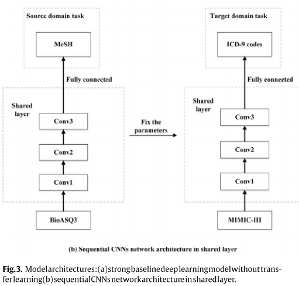

# ICD-9 classify
* ICD-9 classify関連で読んだ論文についての小メモ。

## 2018-11-19
### Classifying medical notes into standard disease codes
* data MIMIC3
* MIMIC3 の大まかな統計値と、基本的なLSTM,CNN,Attention周りのモデル性能比較について書いてある。
* NERシステムにはcTAKESを使用
* 特に新しいモデルとかではない。

### Automatic ICD-9 coding via deep transfer learning
* MeSH domain knowledge の転移学習でICD-9 coding
* sourceをMeSHの分類、ターゲットをMIMIC3 の分類タスク
* BioASQ3自体もmulti-label classificationタスク

### Improving the dictionary lookup approach for disease normalization using enhanced dictionary and query expansion.
* CRF + dictionary lookup
* ただし、githubでデータが上がっている と思ったら消えている
* https://libraries.io/github/TCRNBioinformatics/DiseaseExtract

### 
